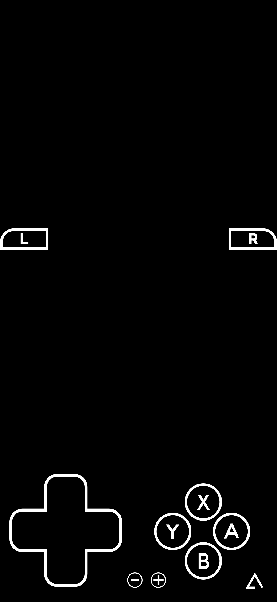

# Delta Emulator Skins

This repository contains skins for the Delta emulator.

## Standard Fullscreen Edge to Edge skin ([StandardFSE2E](NDS/StandardFSE2E/))

This fullscreen skin enables complete fullscreen playability on edge to edge devices, with details such as [Zacksly's Nintendo Switch-inspired icons](https://zacksly.itch.io/switch-button-icons-and-controls) and more accesible LR button positioning for smoother play. Based on [Skudaku's StandardFS skin](https://deltastyles.com/skins/139-standardfs) and extended to edge to edge devices while including support for standard devices. Tested on an iPhone 15. 

Download [StandardFSE2E.deltaskin] and import into Delta Emulator to use.

